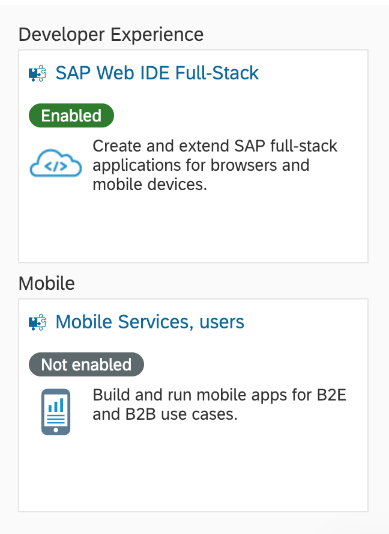
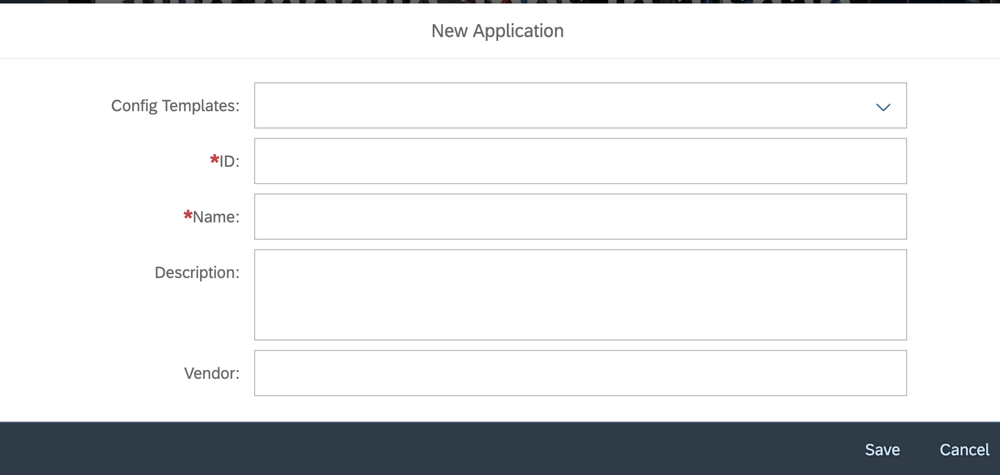

Part of my new role has been moving a number of portal apps to be offline mobile using the MDK framework from SAP. Now we all know SAP loves to grab the latest tech, put a little wrapper around it and somehow make it more complex than the sum of its parts. You also know by now I love a good whinge and hate to be out of my little Javascript comfort zone. 

Except, I kind of like this!! Unlike previous rapid development tools from SAP where I have always felt we could have built a bespoke application in a similar if not quicker time MDK actually feels like I am not only saving time but it is intuitive with my workflow. 

So in this series of posts I will walk you through the creation of your first hello-world MDK app.

First things first, make sure you have an SCP trial account, I also assume you have a relatively good understanding of how to navigate this workspace. 

## Deployment Space and Destinations

1. Navigate to "Services" and ensure that the following two services are enabled :

From "Mobile Services, Users" select "Goto Service" this will take you to your mobile services cockpit where you can add destinations for your services as well as view logs for your running apps and their network connectivity (Found under the Analytics Tab). What we are most interested in at this point however is that big "Create New App" tile. Give it a click and a wizard will greet you..

Config Template : Mobile Development Kit  
ID : com.mdk.helloworld   (Note this is case sensitive)  
Name : HelloWorld  
Description : Simple Hello World App with Navigation  
Vendor :  

Once this is done you willpresented with a screen that shows everything you need to know about your app, we will be back here in a later post to go through this with a bit more detail for now though lets get on to the next step.

## webIDE setup

Open webIDE and click on the settings cog, from here navigate to Extensions and make sure you turn on "Mobile Services App Development Tools" restart webIDE when prompted and you are all set up. 

Ready for Part 2 of this series Building your client.

