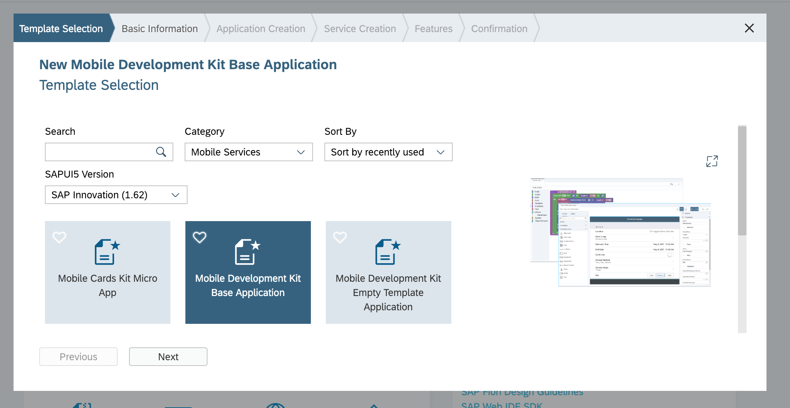
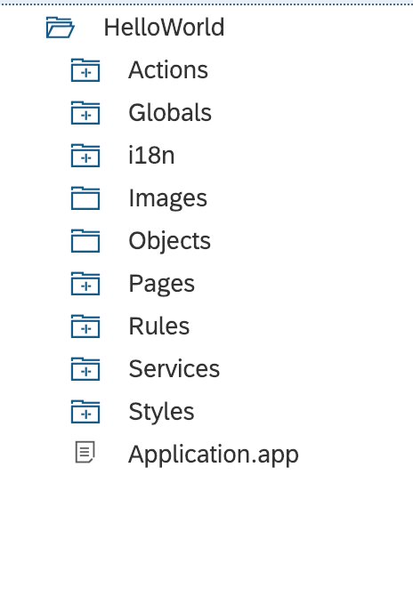
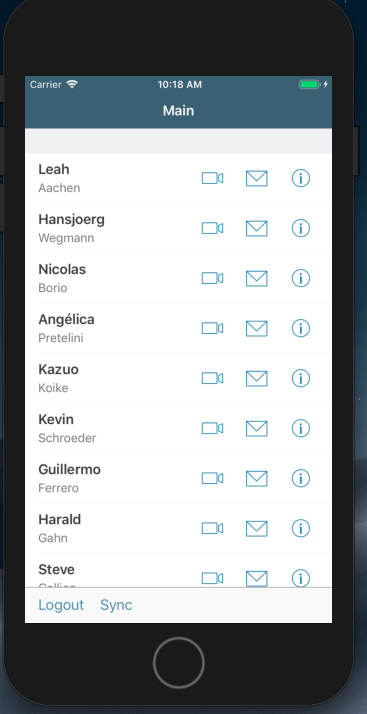

Finally I hear you cry we are going to build our application, the coders amongst you must have been chomping at the bit, well you need to reign that in!! There isnt a lot of coding here, well at least not at the base level we are looking at in this series, I will delve deeper in future posts.

We are going to use the destination created in Part 2 of this series for our data. Fire up webIDE full stack, select new project from template and under the Mobile category select Mobile Development Base Application.

Follow the wizard to add your application name and display name, what follows is a simple screen enabling you to add a service and store it for offline usage, this is the real magic of the MDK. Offline storage setup simply by adding the odata service here. Fill in the details for the sample destination you added earlier. Check service and when you get the blue light click next and add Customers as your offline data to initialize. MDK uses witchcraft to set all this up for you. Click finish and your app is built...

Its probably worth taking a few minutes here to have a look around the structure and the core files particularly "Application.app" as thats where everything hangs together. If you look at Main.page you will see the old drag and drop layout editor you can also open these pages in the code editor and see that they are just JSON files underneath it all.

Now lets dive in to building our first page... Double click on Main.page and in the drag and drop editor (The Coder in us all is now screaming...) place a Contact Cell Table on the screen. Once thats done we can set about binding our services Click the link button in the Target section and add the service we created earlier. Now its just a case of binding all the fields to the entities, you can go wild here, add whatever where-ever. Save your page and lets deploy your application. Right click on the root of your project and select MDK Deploy and Activate.

Thats the app built, for now, if only updating all address books was this easy.

Lets test the app locally, navigate in to the client directory you built in Part 2 and run the following command

<code>tns run ios --emulator</code>

and wait whilst the cliet is compiled, the app is downloaded and your ios simulator starts up. This takes a little bit of time. When finished you have to go through the onboarding process...

Once you are done after a moment initializing the data you should be able to see your app running. In the next post we will cover further developments on this application. 

